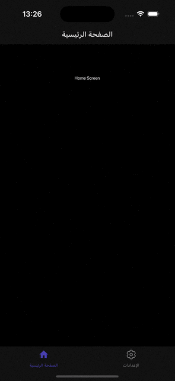

# Scalable React Native Boilerplate by Malik CHOHRA

**Sponsored by [CasaInnov](https://casainnov.com)**

## Introduction
Welcome to the Scalable React Native Boilerplate, a structured starting point for building React Native applications that are maintainable, scalable, and efficient. This boilerplate follows the best practices for organizing your codebase, setting up state management, handling API interactions, theming, and more. We use the latest React Native version and keep all libraries up to date, ensuring compatibility with the most recent features and improvements.

## Features
- **Modern Project Structure**: Organized folder layout to easily manage components, hooks, API, assets, and more.
- **Atomic Design Principles**: Component architecture based on Atomic Design for better reusability and scalability.
- **State Management**: Integrated Redux Toolkit with preconfigured actions, reducers, and selectors for managing app state.
- **API Layer**: Dedicated folder structure for handling API calls, including mock data for development and testing.
- **Theming and Styling**: Centralized theme management with a customizable design system for colors, fonts, and global styles.
- **Navigation Setup**: Modular navigation system using React Navigation for managing stacks, tabs, and nested routes.
- **Testing Setup**: Unit, integration, and end-to-end (E2E) testing configurations using Jest and Detox.
- **CI/CD with Fastlane**: Preconfigured Fastlane setup for automating builds, testing, and deployment to the App Store and Google Play.
- **Localization**: Internationalization (i18n) support with ready-to-use language configuration.
- **Latest Libraries**: All dependencies are up to date, including the latest stable versions of React Native and popular libraries.


## Project Structure with Comments
```
├── e2e                     # Detox configuration for different environments
├── Fastlane                # CI/CD configuration using Fastlane for automated builds and deployment
├── src
├── assets                          # Directory for app assets such as images and fonts
│   ├── images                       # Folder for image assets used in the app
│   ├── package.json                # Package file for managing assets if needed
│   └── icons                        # Folder for SVG or other icon assets
│       ├── iconTransactions.svg     # Icon for transactions
│       ├── iconBlocks.svg          # Icon for blocks
│       ├── iconSettings.svg        # Icon for settings
│       ├── iconEyeInactive.svg     # Inactive eye icon
│       └── iconEyeActive.svg       # Active eye icon
│   └── fonts                        # Folder for font files
│       ├── Roboto-Regular.ttf       # Regular weight of Roboto font
│       └── Roboto-Bold.ttf          # Bold weight of Roboto font
├── api                             # Folder for handling API interactions
│   ├── constant.ts                 # Constants used throughout API calls
│   ├── Api.ts                      # Main API configuration and methods
│   ├── types.ts                    # TypeScript types related to API responses
│   ├── package.json                # Package file for API utilities if needed
│   └── customAPI                   # Custom API services for specific endpoints
│       ├── routes.ts               # Routes for custom API calls
│       └── customApi.ts            # Custom API implementation
├── components                      # Reusable UI components organized by Atomic Design
│   ├── package.json                # Package file for component library
│   ├── atoms                       # Atoms: basic UI components (buttons, inputs, etc.)
│   │   ├── LoadingComponent        # Loading spinner or component
│   │   │   └── index.tsx           # Component implementation
│   │   ├── Button                  # Button component
│   │   │   └── index.tsx           # Component implementation
│   │   │   └── tests__             # Unit tests for Button component
│   │   │       └── LoadingScreen.test.tsx
│   │   ├── Text                    # Text component for consistent styling
│   │   │   └── index.tsx           # Component implementation
│   │   └── StyledImage             # Styled image component
│   │       └── index.tsx           # Component implementation
│   ├── molecules                   # Molecules: combinations of atoms (card, form elements, etc.)
│   └── organisms                   # Organisms: complex components made from molecules and atoms
├── container                       # Context and provider components for global states
│   ├── LanguageHelper.tsx          # Language context provider
│   ├── AppThemeProvider.tsx        # Theme context provider
│   └── package.json                # Package file for container components
├── hooks                           # Custom hooks for reusable logic
│   ├── useAppDispatch.ts           # Hook for dispatching actions in Redux
│   ├── useAppSelector.ts           # Hook for selecting state from Redux store
│   ├── useActions.ts               # Hook for using Redux actions
│   ├── package.json                # Package file for hooks
│   ├── index.ts                    # Entry point for hooks
│   └── useTraceUpdate.ts           # Hook for tracing component updates
├── navigation                      # Navigation setup for the app
│   ├── index.tsx                   # Main navigation entry point
│   ├── AppNavigation               # Navigation component
│   │   ├── index.tsx               # Component implementation
│   │   └── AppScreens.tsx          # Screens defined for navigation
│   ├── package.json                # Package file for navigation
│   ├── LinkingConfiguration.ts      # Configuration for deep linking
│   └── types.tsx                   # TypeScript types related to navigation
├── redux                           # Redux store and configuration
│   ├── appConfig                   # App configuration for Redux
│   │   ├── appConfigSelectors.ts    # Selectors for app config
│   │   ├── appConfigModel.ts        # Model for app config state
│   │   └── appConfig.ts             # Main app configuration
│   ├── package.json                # Package file for Redux
│   ├── rootReducer.ts              # Root reducer for combining all reducers
│   └── store.ts                    # Redux store configuration
├── screens                         # Screens or views of the app organized by features
│   ├── package.json                # Package file for screens
│   ├── HomeScreen                  # Home screen component
│   │   └── index.tsx               # Component implementation
│   └── SettingScreen               # Settings screen component
│       └── index.tsx               # Component implementation
├── theme                           # Theming configuration and styling
│   ├── Colors.ts                   # Color definitions used throughout the app
│   ├── Fonts.ts                    # Font definitions and styling
│   ├── Screens.ts                  # Screen-specific styles
│   ├── globalStyling               # Global styling definitions
│   │   ├── cards.ts                # Card component styles
│   ├── package.json                # Package file for theming
│   └── index.ts                    # Entry point for theme
├── i18n                            # Internationalization configuration
│   ├── allLanguages.ts             # List of all available languages
│   ├── en_GB.ts                    # English (UK) translations
│   ├── fr_FR.ts                    # French translations
│   ├── ar_SA                       # Arabic (Saudi Arabia) translations
│   │   └── common.json             # Common phrases in Arabic
│   ├── index.ts                    # Main entry for i18n configuration
│   ├── newLineProcessor.ts         # Helper for processing new lines in translations
│   ├── en_GB                       # English (UK) translations (nested)
│   │   └── common.json             # Common phrases in English (UK)
│   └── fr_FR                       # French translations (nested)
│       └── common.json             # Common phrases in French
└── types                           # TypeScript type definitions for global use
│   ├── i18next.d.ts                # Type definitions for i18next
│    └── declarations.d.ts           # Global declarations
└── __tests__               # Unit and integration tests for components and screens
```


## Example App



## Key Libraries and Versions
- **React Native**: 0.75.3
- **React Navigation**: v6 < 6.4.1>
- **Redux Toolkit**: For state management: 2.2.7
- **React Native Paper**: For theming and UI components: 5.12.5
- **Jest & Detox**: For testing < 20.26>
- **Fastlane**: For CI/CD <>
- **Axios**: For making API requests: 0.27.2
- **Luxon**: For date and time handling: 2.3.1
- **React i18next**: For internationalization: 11.11.4
- **React Native Config**: For managing environment variables: 1.4.2
- **React Native Fast Image**: For optimized image loading: 8.5.11
- **React Native Localize**: For localization: 2.1.7
- **React Native Reanimated**: For animations: 2.3.0
- **React Native Size Matters**: For responsive design: 0.4.0
- **React Native Splash Screen**: For splash screen management: 3.2.0
- **React Native SVG**: For SVG support: 12.1.1
- **React Native Vector Icons**: For icon management: 9.1.0
- **Redux Persist**: For persisting Redux state: 6.0.0

## What can be done
This React Native application, built on version 0.75.3, showcases a robust architecture designed for seamless user experiences. Leveraging React Navigation (v6 < 6.4.1>), the app provides intuitive navigation across various screens, ensuring users can easily access features. With Redux Toolkit (2.2.7) for state management, it efficiently handles complex application states, allowing for smooth data flow and real-time updates.

The UI is enhanced by React Native Paper (5.12.5), which offers a comprehensive set of customizable components and theming options, creating a visually appealing interface. To ensure quality, the app integrates Jest and Detox (< 20.26>) for testing, enabling rigorous automated testing and quality assurance. Fastlane streamlines the CI/CD process, facilitating efficient deployment and updates.

API interactions are managed using Axios (0.27.2), allowing for flexible and robust communication with backend services. For date and time handling, Luxon (2.3.1) provides an intuitive API, ensuring that time-related data is accurately managed.

Internationalization is achieved with React i18next (11.11.4) and React Native Localize (2.1.7), enabling support for multiple languages and regional settings, enhancing accessibility for a global audience. The application efficiently manages environment variables using React Native Config (1.4.2), ensuring sensitive data remains secure and organized.

For optimal media handling, React Native Fast Image (8.5.11) enhances image loading performance, while React Native SVG (12.1.1) provides scalable vector graphics support, allowing for rich visual content. React Native Vector Icons (9.1.0) simplifies icon management, providing a wide array of customizable icons.

Animations are made fluid and responsive with React Native Reanimated (2.3.0), enhancing user engagement through visually appealing transitions. Additionally, React Native Size Matters (0.4.0) ensures responsive design across various device sizes, while React Native Splash Screen (3.2.0) adds a polished introduction to the app. Finally, Redux Persist (6.0.0) allows for state persistence, ensuring a smooth user experience even after app restarts.

Overall, this app combines powerful libraries and a well-structured codebase to create a feature-rich and user-friendly mobile application

## Getting Started

### Prerequisites
Make sure you have the following installed:
- Node.js (>= 14.x)
- Yarn or npm 
- Xcode (for iOS development)
- Android Studio (for Android development)

### Installation
Clone the repository:
```bash
git clone git@github.com:chohra-med/scalableReactNativeBoilerplate.git
```
Install the dependencies:
```bash
cd scalableReactNativeBoilerplate
yarn 
```
Start the development server:
```bash
yarn start
```
Run the app on iOS:
```bash
yarn ios
```
Run the app on Android:
```bash
yarn android
```

## Testing

### Unit Tests
Run unit tests with Jest:
```bash
yarn test
```

### E2E Tests
Run end-to-end tests with Detox:
```bash
yarn detox build -c ios
yarn detox test -c ios
```

## CI/CD with Fastlane
The boilerplate includes a basic Fastlane setup for automating builds, testing, and deployment.

Build the app for Android and iOS:
```bash
cd fastlane
fastlane android beta
fastlane ios beta
```


## Contributing
Contributions are welcome! Please follow these steps:
1. Fork the repository.
2. Create a new branch (`feature/new-feature`).
3. Commit your changes.
4. Push to the branch.
5. Open a pull request.

## License
This project is licensed under the MIT License.

## Acknowledgments
Thanks to the community for maintaining awesome libraries that make React Native development easier.

## Developed by Malik CHOHRA
For collaboration, find me on [LinkedIn](https://www.linkedin.com/in/malik-chohra/).

Visit [CasaInnov](https://casainnov.com) if you need any collaboration.
